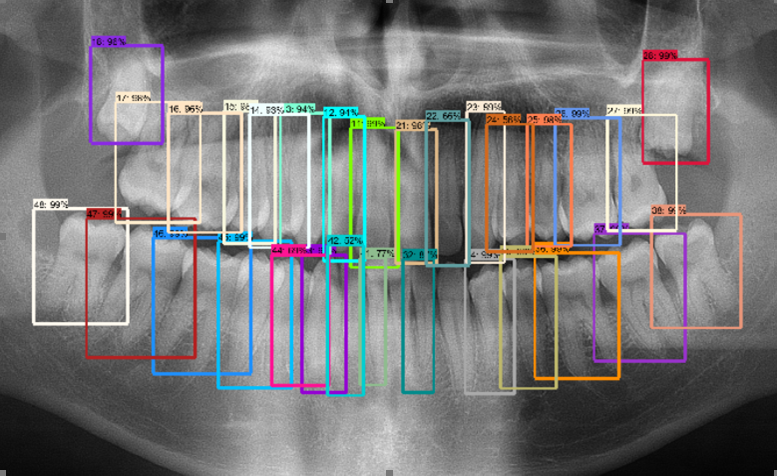

# Object detection for stomatology problem

Problem is solved by using Tensorflow 1.15 Object Detection API. https://github.com/tensorflow/models/tree/master/research/object_detection

1. Generate TFRrecords

2. Setup .config file for model you want to use

3. Train model

4. Test model

5. Export graph from model

